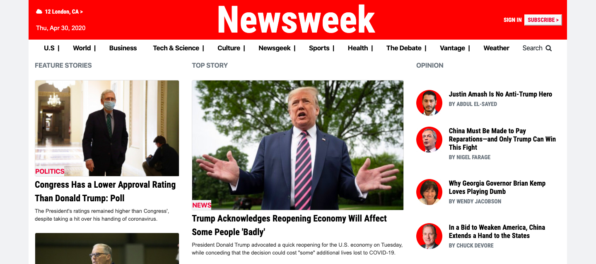
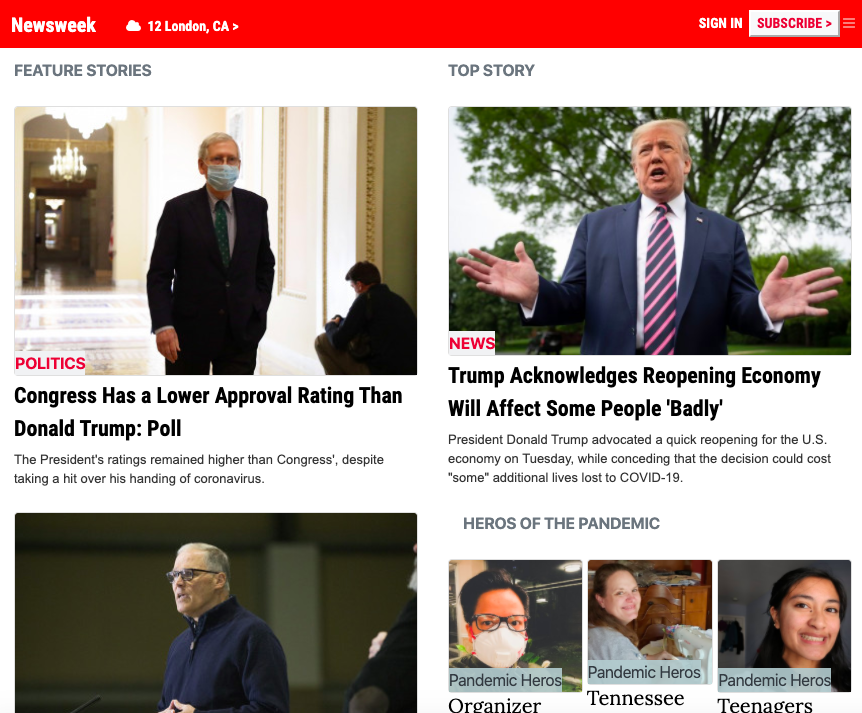
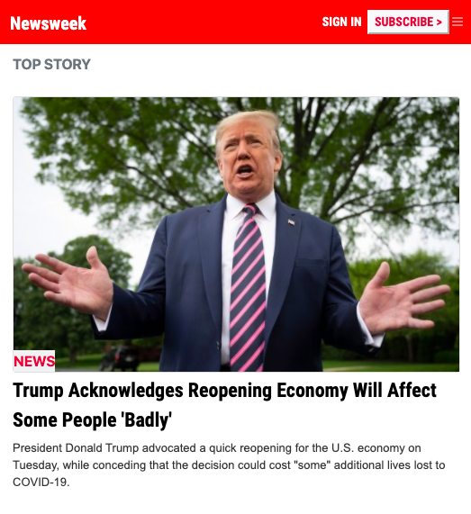

# Newsweek-clone

This project requests students to build a replica of the news site Newsweek (https://www.newsweek.com/) using the Bootstrap framework.

- desktop version

- mobile version (medium screen): tablet

- mobile version version (small screen): cell phone

## Built With

- HTML & CSS,
- bootstrap,
- VS Code

## Live Demo

[Live Demo Link](https://raw.githack.com/brugobi/Newsweek-clone/master/index.html)

## Getting Started

To get a local copy up and running follow these simple example steps.

- From the repository, click + in the global sidebar and select Clone this repository under Get to work.
- Copy the clone command (either the SSH format or the HTTPS). ...
- From a terminal window, change to the local directory where you want to clone your repository.

## Usage

- Any Brownser

👤 **Author**

- Github: [@brugobi](https://github.com/brugobi)
- Twitter: [@BrunaGobi2](https://twitter.com/BrunaGobi2)
- Linkedin: [linkedin](https://www.linkedin.com/in/bruna-gobi-08854760/)

## 🤝 Contributing

Contributions, issues and feature requests are welcome!

Feel free to check the [issues page](issues/).

## Show your support

Give a ⭐️ if you like this project!

## Acknowledgments

- Hat tip to anyone whose code was used
- Inspiration
- Microverse

## 📝 License

This project is [MIT](lic.url) licensed.
